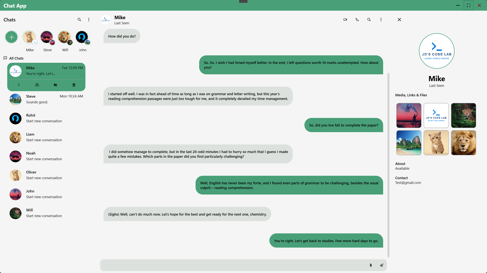

# ChatApp

UI have:
- Chat list
- Contact info
- Conversation
- Status thumbs

Dependency library:
- AutoMapper
- Microsoft.Extensions.Hosting
- Microsoft.Xaml.Behaviors.Wpf
- Microsoft.Extensions.Configuration.Json
- Serilog
- Serilog.AspNetCore
- Serilog.Enrichers.Environment
- Serilog.Extensions.Hosting
- Serilog.Settings.Configuration
- Serilog.Sinks.Console
- Serilog.Sinks.Debug
- Serilog.Sinks.File

# ChatApp.Infrastructure
Data process layer
- Dapper
- SQL connection factory
- Repositoy

Dependency library:
- AutoMapper
- Microsoft.Extensions.Logging.Abstractions

# ChatApp.Core
Shared data layer
Provider data model for all project and logics.
- Chat logics.

Dependency library:
- AutoMapper
- Microsoft.Data.SqlClient

# ChatApp.Tests
Use xUnit project.
- Repositoy test
- Service test
- ViewModel test

# Toolkit.Wpf.Mvvm
Provider mvvm tool. 
- Property
- Command
- Event aggregator

# Toolkit.Mvvm.Wpf
